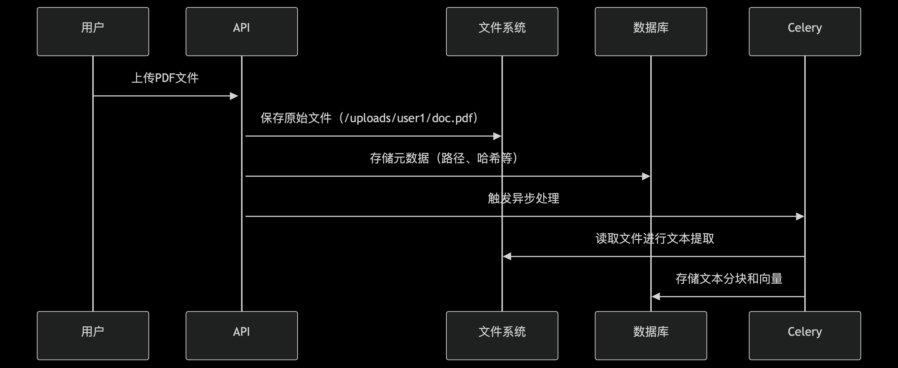
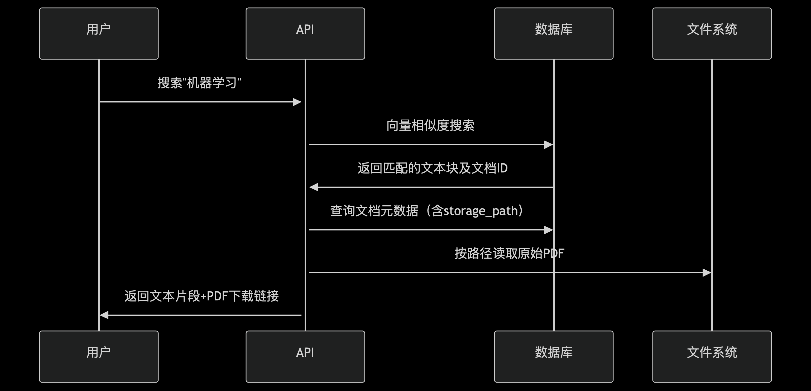
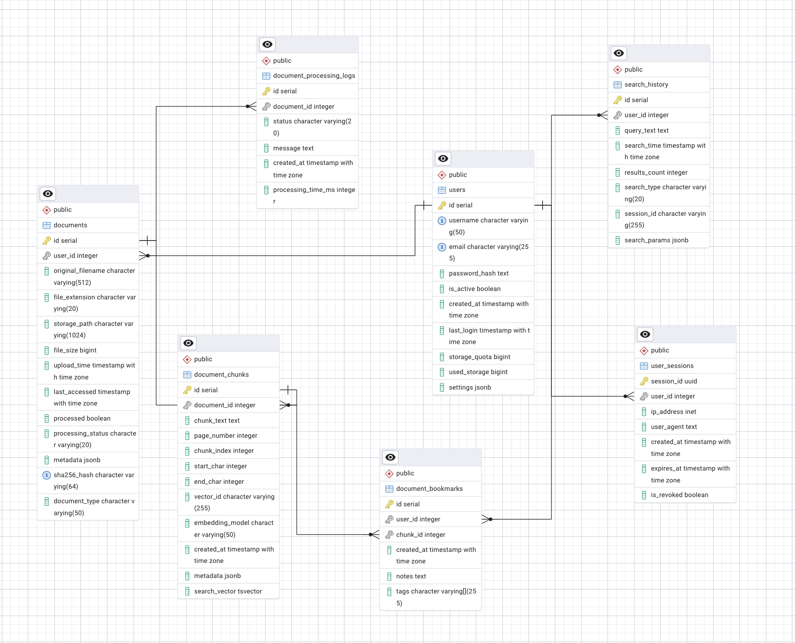
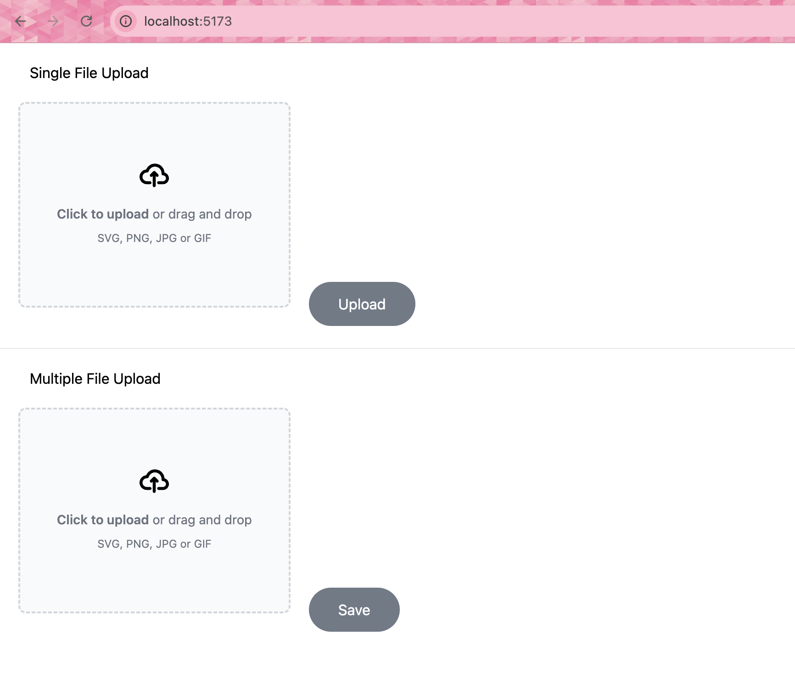
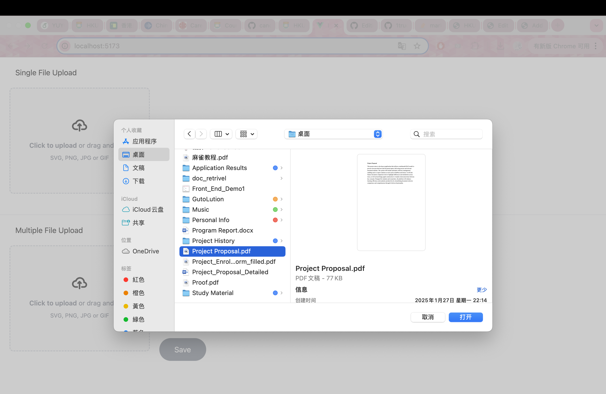
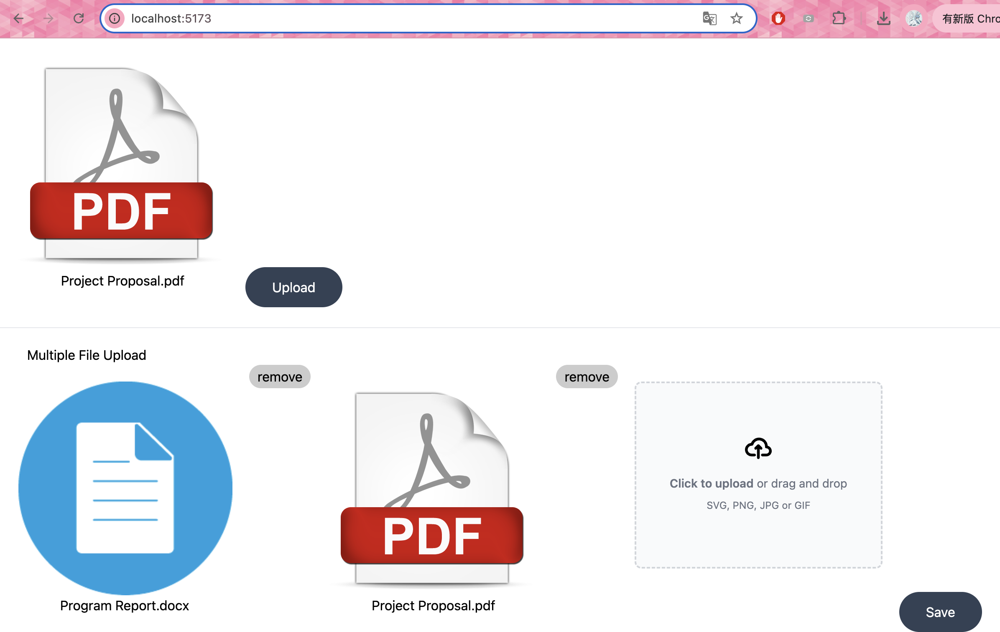

## The project pipeline



## Application functions


## Running the demo of the app locally:
Ensure that you install Python 3.10. 
Ensure that you install Pytorch.

# For Mac 
```
brew install poppler
```
# For Windows
You may directly download it from http://blog.alivate.com.au/poppler-windows/

# Install dependencies and run the app
```
cd pdf_rag/
pip install -r requirements.txt
streamlit run pdf_rag.py
```
# make sure that you put streamlit on you PATH.

## Front End Layout
### Default

### Choose file

### Add one or more file to upload

