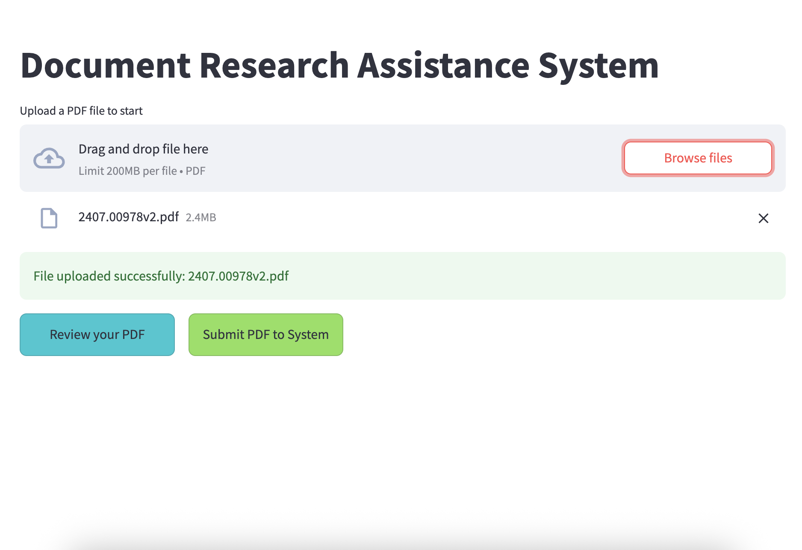

## The project pipeline


## Application functions


## Running the demo of vue front-end locally:
Ensure that you install Python 3.10. 
Ensure that you install Pytorch.

** For mac
```
brew install poppler
```

To run this app, you need to
```
cd your_app_folder/
pip install -r requirements.txt
streamlit run pdf_rag.py
```
On windows, make sure that you put streamlit on you PATH.

<a href="https://ibb.co/p69RPHVT" target="_blank"></a>

## Front End Layout
### Default

### Choose file

### Add one or more file to upload

